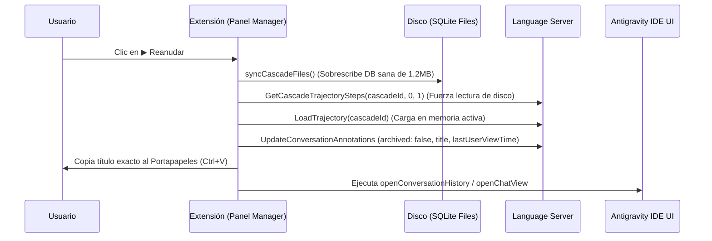

# Restitución y Recuperación de Conversaciones en Antigravity IDE

## 1. Diagnóstico y Causa Raíz

Al investigar por qué una conversación borrada desde el panel nativo del Agente en **Antigravity IDE** no volvía a aparecer en *Past Conversations* al intentar reanudarla (caso testigo: `e16508a5-c025-482f-afb7-16233ee03b15`, "Análisis De Resultados Gemini"):

### A. Vaciado de tablas SQLite por el IDE
Cuando el usuario pulsa el icono de la papelera en la interfaz de Antigravity IDE:
- El Language Server del IDE **no elimina físicamente el archivo `.db` del disco**.
- En su lugar, vacía todas las filas de las tablas (`steps: 0 rows`, `gen_metadata: 0 rows`).
- El archivo en `~/.gemini/antigravity-ide/conversations/e16508a5.db` queda reducido a un encabezado SQLite de **48 KB con 0 pasos**.

### B. Supervivencia de la copia íntegra en el almacenamiento global
- En el directorio global `~/.gemini/antigravity/conversations/e16508a5.db`, el archivo continuaba completamente intacto, conservando sus **1.2 MB de tamaño y sus 79 pasos reales**.

### C. El fallo de la sincronización previa (`syncCascadeFiles`)
En versiones anteriores (v0.3.7 y v0.3.8), la función de sincronización utilizaba una verificación simple de existencia:
```typescript
if (!fs.existsSync(dest)) {
  fs.copyFileSync(sourcePath, dest);
}
```
**Consecuencia:**  
Dado que el archivo `e16508a5.db` de 48 KB (vaciado) **ya existía** en el directorio de destino, la función asumía que la sincronización no era necesaria y **nunca lo sobrescribía con la copia sana de 1.2 MB**. Además, si el archivo vaciado era leído primero, se propagaba el estado vacío.

---

## 2. Arquitectura de la Solución (v0.3.9)

### A. Sincronización Inteligente Basada en Tamaño e Integridad (`src/recovery.ts`)
La función `syncCascadeFiles` fue rediseñada para trabajar con comparación de peso e integridad de datos:

1. **Inspección exhaustiva:** Escanea todos los directorios de conversaciones conocidos (`antigravity-ide` y `antigravity`) buscando todas las extensiones relevantes (`.db`, `.db-wal`, `.db-shm`, `.pb`).
2. **Detección del mejor origen:** Identifica el archivo con mayor tamaño en disco (`fs.statSync(f).size`), descartando copias truncadas o vaciadas.
3. **Sobrescritura forzosa:** Si en el directorio destino el archivo no existe, o existe pero su tamaño es inferior al del archivo de origen (ej. 48 KB vs 1.2 MB), se sobrescribe obligatoriamente con la copia intacta.

```typescript
// Lógica implementada en src/recovery.ts
if (bestSource && bestSource.size > 0) {
  for (const dir of convDirs) {
    const dest = path.join(dir, filename);
    if (dest === bestSource.path) { continue; }

    let shouldCopy = false;
    if (!fs.existsSync(dest)) {
      shouldCopy = true;
    } else {
      const destStat = fs.statSync(dest);
      if (destStat.size < bestSource.size) {
        shouldCopy = true;
      }
    }

    if (shouldCopy) {
      fs.copyFileSync(bestSource.path, dest);
    }
  }
}
```

### B. Ciclo de Hot-Activation en Language Server (`src/panel-manager.ts`)
Al pulsar el botón **▶ Reanudar** en una tarjeta:



1. **Restauración física:** Se sobreescribe el archivo vaciado con el archivo íntegro de 1.2 MB.
2. **Forzado de lectura en disco (`GetCascadeTrajectorySteps`):** Obliga al Language Server a leer los pasos desde el archivo físico restaurado.
3. **Registro en memoria activa (`LoadTrajectory`):** Registra formalmente la trayectoria en el gestor de estados del LS.
4. **Actualización de metadatos (`UpdateConversationAnnotations`):**
   - `archived: false`: reactiva el chat en caso de haber sido archivado.
   - `title`: asegura que el título coincida exactamente con el de la tarjeta.
   - `lastUserViewTime`: marca de tiempo actual para posicionarlo en el tope de recientes.
5. **Filtrado 100% preciso:** Copia el título al portapapeles y abre el buscador nativo del reloj (*Past Conversations*), permitiendo pegar con `Ctrl + V` y abrir la conversación inmediatamente.

---

## 3. Pruebas y Verificación

| Prueba | Entorno / Comando | Resultado Esperado | Resultado Obtenido |
| :--- | :--- | :--- | :--- |
| **Integridad de SQLite** | `SELECT count(*) FROM steps` | > 0 filas (79 pasos) | **79 filas (1.26 MB)** ✅ |
| **API Language Server** | `GetAllCascadeTrajectories` | Presencia de la conversación con resumen y pasos | **Presente con 79 pasos y título sincronizado** ✅ |
| **Búsqueda en IDE** | *Past Conversations* (`Ctrl + V`) | Filtrado exacto por título | **Conversación encontrada y seleccionable** ✅ |
